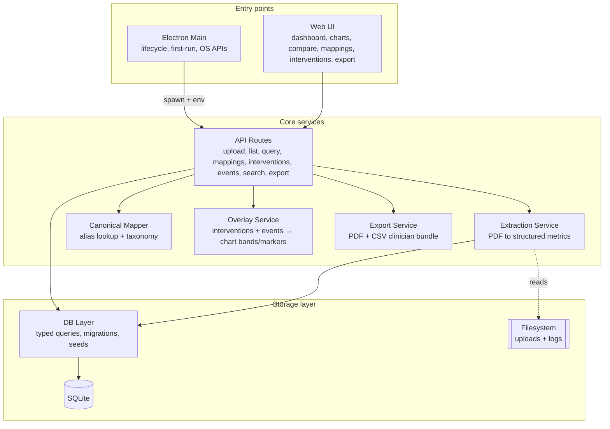
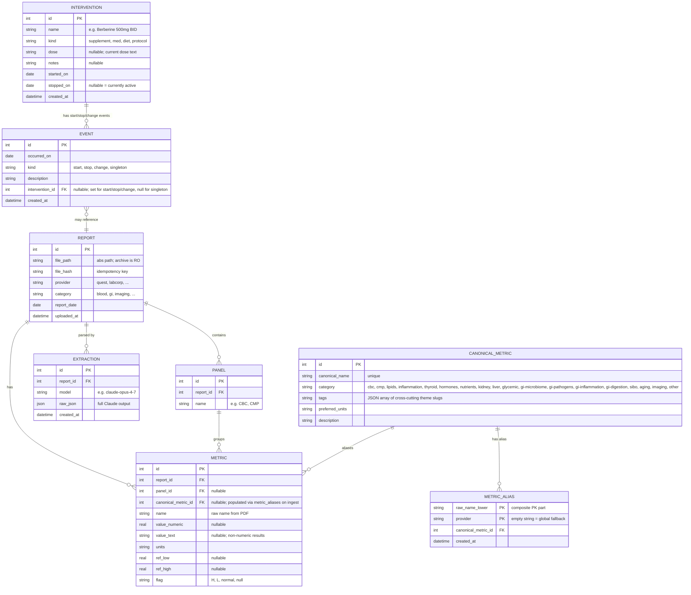
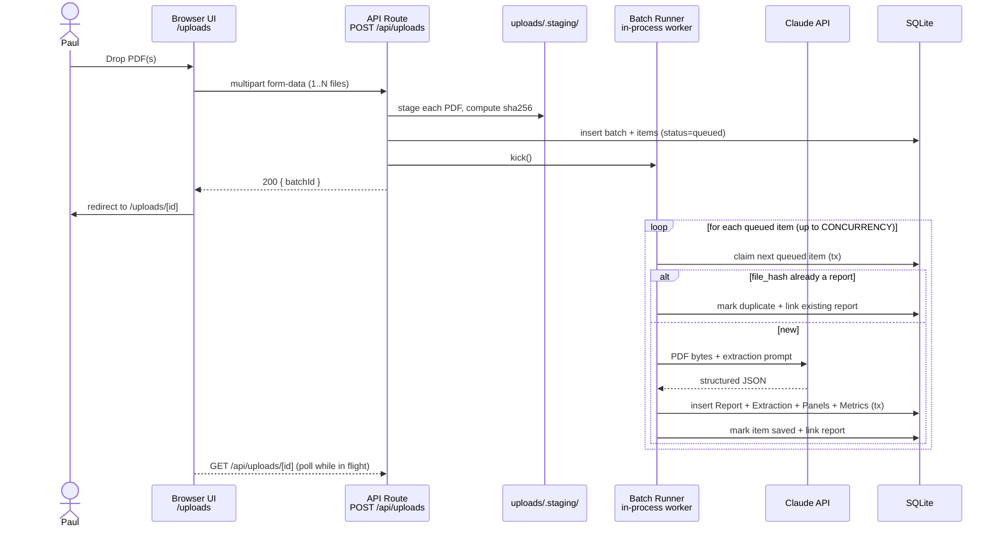
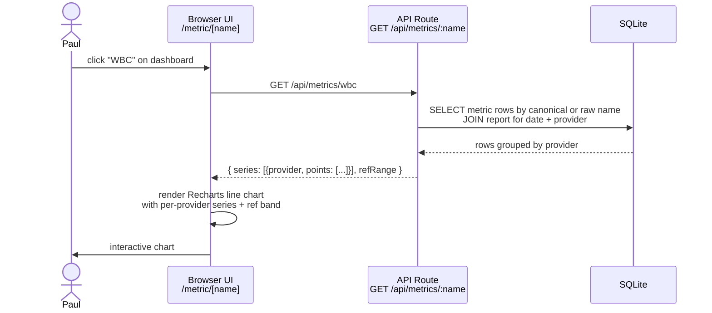
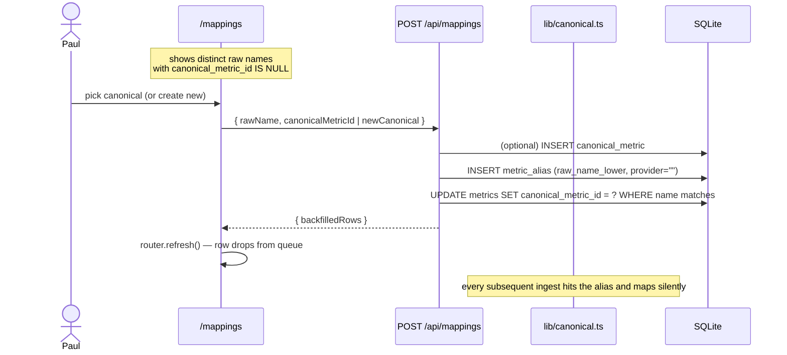
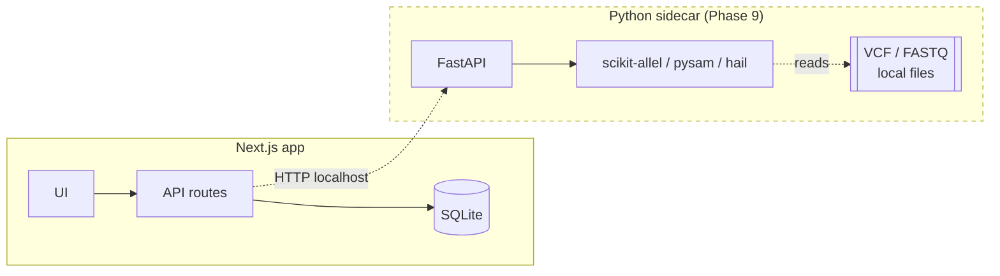

# ARCH — Health

> High-level architecture for the personal health-tracking app at `~/projects/health`.
> **Level:** Application (Next.js app running locally or wrapped in an Electron shell for distribution) — with documented extension points for a future Python DNA sidecar that will promote this to a System-level architecture post-MVP.
> **Status:** v0.3 — updated 2026-04-18 with Phase 4 (canonical metrics, categories, interventions, clinician export).

See [VISION.md](./VISION.md) for scope, goals, and non-goals. See [PLAN.md](./PLAN.md) for the phased roadmap.

---

## System Overview

The app runs locally as a Next.js application, hosted either by the browser (`pnpm dev`) or inside an Electron shell (`pnpm app:dev` / packaged `.app`). It receives PDF reports through the `/uploads` page, sends them to the Claude API for structured extraction, and persists results in a local SQLite database. A future DNA sidecar is shown dashed — not built in MVP.

```mermaid
graph LR
    User((User))

    subgraph Local["Local machine"]
        subgraph Electron["Electron app (Health.app)"]
            MAIN[Main process<br/>lifecycle, windows, OS APIs]
            subgraph App["Next.js app (embedded server + renderer)"]
                UI[Browser UI<br/>React + Recharts]
                API[API routes]
                EXT[Extraction service]
                DB[(SQLite<br/>better-sqlite3)]
            end
            MAIN --> App
        end

        USERDATA[[~/Library/Application Support/Health<br/>data/health.db · uploads/ · logs/]]

        subgraph Future["Post-MVP"]
            DNA[Python DNA sidecar<br/>FastAPI]
            DNAFILES[[DNA files<br/>VCF/FASTQ]]
        end
    end

    CLAUDE[[Claude API<br/>Anthropic]]

    User -->|native window| UI
    UI <--> API
    API <--> DB
    API --> EXT
    EXT -->|PDF bytes| CLAUDE
    EXT --> DB
    DB -.file I/O.-> USERDATA
    API -.read/write.-> USERDATA

    API -.HTTP localhost.-> DNA
    DNA -.reads.-> DNAFILES

    style Future stroke-dasharray: 5 5
    style DNA stroke-dasharray: 5 5
    style DNAFILES stroke-dasharray: 5 5
```



In web-dev (`pnpm dev`), the Electron shell is absent — the browser is the user agent and per-user storage maps to project-relative `./data/` and `./uploads/`. The `lib/paths.ts` helper branches on `HEALTH_USER_DATA_DIR` (set by Electron main) so the same code runs in both contexts.

**Key boundaries**
- Everything runs on one machine. The only network egress is to the Claude API.
- Per-user state is rooted at `app.getPath('userData')` under Electron, and at the project root in web-dev.
- The DNA sidecar is isolated over localhost HTTP — the Next.js app treats it as an external service and works fine without it.

---

## Component Architecture

Inside the Next.js app, responsibilities split into conceptual components. Most are plain modules; API routes and the Electron main are the "entry points."



### Component boundaries

| Component | Owns | Does NOT own |
|-----------|------|--------------|
| **Electron Main** | App lifecycle, native window(s), OS path resolution (`app.getPath('userData')`), spawning + supervising the embedded Next.js server, first-run key prompt, Keychain storage via `safeStorage` | HTTP, DB, or extraction logic — the embedded Next.js layer owns all of that |
| **Web UI** | Chart rendering, upload UX, navigation, metric browsing, category/tag filter chips, search palette, compare view, interventions + events CRUD, export picker | Extraction logic, DB schema decisions |
| **API Routes** | Request/response shapes, input validation, orchestrating extraction / mapping / overlays / export | Rendering, Claude prompt details |
| **Extraction Service** | Claude API calls, prompt templates, parsing + validating returned JSON, persisting raw output for replay | Business meaning of metrics, canonical mapping |
| **Canonical Mapper** (`lib/canonical.ts` + `lib/canonical-util.ts`) | Resolving raw metric names → `canonical_metric_id` via `metric_aliases` (provider-scoped → global fallback); normalizing raw names | Extracting metrics from source PDFs |
| **Overlay Service** (`lib/overlays.ts` + `lib/interventions.ts` + `lib/events.ts`) | Transactional intervention lifecycle (start = row + event, stop = update + event, change = update + event), overlay composition for charts | Chart rendering (client) |
| **Export Service** (`lib/export.ts` + `lib/pdf/clinician-pdf.tsx`) | Dataset assembly (date window + canonical ids → series with stats + observations + interventions in window), PDF rendering via `@react-pdf/renderer`, CSV writer | Storage, network transport |
| **DB Layer** | Migrations, typed queries, transactions, SQLite file lifecycle, canonical-metric seed apply (idempotent) | Schema semantics beyond storage |

---

## Data Model

`Report` + `Metric` are the spine; everything else is grouping (`Panel`), aliasing (`CanonicalMetric` + `MetricAlias`), auditing (`Extraction`), or overlay (`Intervention` + `Event`).



Notes:
- **`file_hash` on Report** makes ingest idempotent — re-running the CLI never duplicates a report.
- **`Extraction.raw_json`** is the audit/replay record. We can re-derive `Metric` rows without re-calling the API.
- **`CanonicalMetric`** holds the taxonomy (category + cross-cutting tag array). Seeded at install; extended via `/mappings` when Paul confirms a new raw name.
- **`MetricAlias`** resolves raw metric names at ingest time (provider-scoped first, `provider = ""` global fallback). Fail-open: a miss leaves `metrics.canonical_metric_id` null and the row queues at `/mappings` for review.
- **`Intervention`** is the "thing you started" (Berberine, Low-FODMAP, a med course). A band on charts spans `started_on → stopped_on` (or to today if active). Dose / name changes are recorded as `kind:change` events on the same intervention.
- **`Event`** is either a start/stop/change tied to an intervention (for the band edges + change log) or a `singleton` — travel, illness — with `intervention_id = NULL`, rendered as a dashed vertical line.

---

## Key Flows

### Flow 1 — Upload one or many PDFs through the UI

Uploads are always tracked as a server-side "batch" record (even for a single file), so the user can navigate away and return to watch progress.



### Flow 2 — View a metric over time



### Flow 3 — Map a raw metric name to a canonical

Happens twice: silently on ingest (for names already aliased) and interactively at `/mappings` for new names.



### Flow 4 — Start / stop an intervention

```mermaid
sequenceDiagram
    actor User as Paul
    participant UI as /interventions
    participant API as POST /api/interventions
    participant DB as SQLite
    participant CHART as Metric + Compare charts

    User->>UI: "Started Berberine 500mg BID, 2025-06-15"
    UI->>API: { name, kind, dose, startedOn }
    API->>DB: tx { INSERT intervention; INSERT event kind:start }
    API-->>UI: { intervention }
    UI->>CHART: overlay bands redraw on next render
    Note over CHART: shaded band spans started_on → today<br/>while stopped_on IS NULL
    User->>UI: "Stop today"
    UI->>API: PATCH /api/interventions/[id] { action: "stop", stoppedOn }
    API->>DB: tx { UPDATE intervention.stopped_on; INSERT event kind:stop }
    API-->>UI: { intervention }
    UI->>CHART: band terminates at stopped_on
```

### Bulk ingest

Handled by the same `/uploads` flow as Flow 1 — the multi-file drop path with auto-confirm, shipped in the Post-MVP polish iteration. An earlier plan included a `pnpm ingest` CLI; replaced in Phase 1 by the browser flow and not reintroduced.

---

## Integration Points

| Protocol | Used for | Direction | Notes |
|----------|----------|-----------|-------|
| HTTP (localhost) | Renderer ↔ embedded Next.js API | Bidirectional | Intra-Electron in packaged mode; browser ↔ dev server in web-dev |
| Filesystem | DB file + uploaded PDFs + logs | Read/write | Rooted at `app.getPath('userData')` in the packaged app; project-relative (`./data/`, `./uploads/`) in web-dev. All call sites go through `lib/paths.ts` |
| HTTPS (egress) | Next.js → Claude API | Outbound only | Only external call in MVP |
| SQLite file I/O | App ↔ `health.db` | Read/write | Single-writer, synchronous (`better-sqlite3`) |
| Electron IPC | Main ↔ renderer (first-run) | Bidirectional | Single channel today: `health:save-api-key`. Preload script exposes a narrow `window.health` API via `contextBridge` |
| OS APIs (Electron) | Main process | Outbound only | `app.getPath('userData')`, `safeStorage` (macOS Keychain-backed), window lifecycle, dock/menu |
| HTTP (localhost) | Next.js → DNA sidecar | **Post-MVP** | See Extension Points |

---

## Tech Stack

| Layer | Choice | Why |
|-------|--------|-----|
| App framework | Next.js 15 (App Router, TS) | Single-process full-stack; easy to run locally; solid React DX |
| UI | Tailwind + shadcn/ui | Fast scaffold, good defaults, no design-system overhead. Visual direction lives in `./design/` (tokens, primitives, screen layouts) — see PLAN for per-phase adoption. |
| Charts | Recharts | Composable, good enough for line charts + ref bands; low bundle cost |
| DB | SQLite via `better-sqlite3` | Zero-config, synchronous, single-user fit; portable file |
| Migrations + schema | `drizzle-orm` + `drizzle-kit` | All schema changes go through Drizzle — single source of truth, typed queries, generated migrations |
| Extraction | Claude API (`@anthropic-ai/sdk`) with native PDF input | Avoids per-lab regex; handles varied provider formats |
| Runtime | Node 22+ | Minimum Node 22 (per `package.json` engines); Paul runs Node 25 locally |
| Package manager | pnpm with `node-linker=hoisted` | Flat `node_modules` layout — needed so `electron-builder`'s native-module rebuild and `next start` inside the packaged app both work reliably |
| Desktop shell | Electron (41.x) | Wraps Chromium + Node; `better-sqlite3`, Anthropic SDK, filesystem, and Next.js API routes all work unchanged inside it. Avoids the architectural rewrite that Tauri would require to split SQLite/extraction into a Rust backend |
| Packaging | `electron-builder` (26.x) with `asar: false` | Produces the `.app` bundle; `asar: false` simplifies Phase 5, revisit in Ph7 if bundle size becomes a real complaint |
| Native-module rebuild | `@electron/rebuild` (via `electron-rebuild` CLI) | Explicit step in `pnpm app:build` that flips `better-sqlite3.node` to Electron's Node ABI before packaging. `electron-builder`'s built-in rebuild was unreliable against our layout, so `npmRebuild: false` is set in the build config |
| Command palette | `cmdk` (via shadcn `command` primitive) | `⌘K` + dashboard search trigger; results split by Metrics / Unmapped / Reports. No fuzzy match — LIKE on canonical names + aliases + providers + dates |
| Clinician PDF | `@react-pdf/renderer` | Renders inside the Next.js process (no headless Chrome). JSX for layout + inline SVG for per-metric mini charts; cover + one page per metric + an interventions-in-window page. Letter size by default |

---

## Target Architecture

| Component | Platform | Architecture | Notes |
|-----------|----------|--------------|-------|
| Electron app | macOS (minimum TBD at Phase 7 build config; Apple Silicon primary, x86_64 optional) | arm64 | The unit of distribution; produced by `pnpm app:build` |
| Embedded Next.js server | Inside Electron main process | — | Spawned as a child via `process.execPath` + `ELECTRON_RUN_AS_NODE=1`; binds to a free port on startup |
| SQLite file | `app.getPath('userData')/data/health.db` | — | Per-user, outside the app bundle |
| Uploaded PDFs | `app.getPath('userData')/uploads/` | — | Per-user, outside the app bundle |
| Staging | `app.getPath('userData')/uploads/.staging/` | — | Per-user |
| Stored API key | macOS Keychain (via `safeStorage.encryptString`, bytes written to `userData/keychain.bin`) | — | Keyed by bundle id `com.lamthalabs.health` |

Phase 5 produces an unsigned `.app` via `pnpm app:build`. Signed/notarized distribution + auto-update arrive in Phase 7. If we later need Linux/x86_64, the app remains portable — it only depends on Node + a writable filesystem + egress to `api.anthropic.com`.

---

## Architectural Considerations

**Privacy.** Health data is sensitive. DB and uploads never leave the installing user's machine except as direct calls to the Claude API. Extraction sends PDF bytes to the Claude API using that user's own API key — this is the one privacy-relevant egress, clearly surfaced at first-run setup. Raw extractions persist locally so we never re-send the same PDF unless asked. In the packaged app, per-user data lives in the OS-managed area (`~/Library/Application Support/Health/`), not inside a repo checkout.

**Reliability.** Crown jewel is the SQLite DB (`./data/health.db` in web-dev; `~/Library/Application Support/Health/data/health.db` in the packaged app). Everything else is reproducible from `Extraction.raw_json`. A simple backup cadence — `cp` to an external location — applies to both paths. Migrations must be forward-only; the packaged app auto-applies them on startup so distributed users never need a CLI.

**Performance.** Dataset is tiny — tens of reports, low-thousands of metric rows. No performance concerns in MVP. Claude API latency (seconds per PDF) is the dominant ingest cost. Electron adds ~1–2s Chromium warm-up at launch on Apple Silicon; runtime perf after that is identical to web-dev.

**Extraction quality.** The risk area. Different provider formats will stress the prompt differently. Mitigations: (1) validate returned JSON against a Zod schema, (2) persist `Extraction.raw_json` so we can re-parse with a better prompt without re-spending, (3) UI shows the source PDF alongside extracted values for spot-checking.

**Testing.** At the architecture level: golden-file tests for the extractor on a small set of checked-in (or referenced) PDFs, and migration tests against snapshot DBs. For the packaged app, one end-to-end smoke test (launch `.app`, ingest a PDF, confirm persistence). No E2E browser tests in MVP.

**Security.** Access to the app is access to the machine — no auth in-app. In web-dev, `ANTHROPIC_API_KEY` reads from `.env` (gitignored). In the packaged app, the key is entered once via first-run setup and stored via Electron's `safeStorage` (macOS Keychain-backed), keyed by bundle id `com.lamthalabs.health`. `.env` is explicitly excluded from the packaged bundle so the developer's key never ships to users.

---

## Key Decisions

| Decision | Choice | Alternatives considered |
|----------|--------|-------------------------|
| Full-stack framework | Next.js single-process | Python FastAPI backend + React frontend — more moving parts for MVP; deferred for DNA sidecar only |
| PDF extraction strategy | Claude API with native PDF input | Per-provider regex/parsers (brittle); Tesseract + LLM (more plumbing) |
| Database | SQLite | Postgres (overkill for single-user local); DuckDB (great for analytics, less ergonomic for transactional upload flow) |
| Sync vs async extraction | Synchronous during upload | Background job queue (adds infra for MVP; reconsider if extraction latency hurts UX) |
| Canonical metric mapping | **Post-hoc alias lookup** via `metric_aliases` — extraction stays neutral on canonical names; resolution happens during ingest (provider-scoped → global fallback) and misses queue at `/mappings` for human review | Extractor emits canonical names directly (couples Claude's non-determinism to the taxonomy); fuzzy read-time match (hides the mapping decision, unpredictable `/compare`) |
| Alias scope | **Provider-scoped** composite PK `(raw_name_lower, provider)`; empty-string provider = global fallback row | Global-only — would conflate providers that print the same raw name for different things; NULL as the global sentinel — SQLite PKs treat NULLs as distinct so the uniqueness would break |
| Category taxonomy | **Fixed string-union** in `db/seeds/taxonomy.ts` (18 categories + 8 cross-cutting tags); enforced in TS; stored as TEXT | SQLite CHECK constraint (Drizzle-kit doesn't evolve check constraints cleanly); DB-level enum table (overkill for an enum that only changes with code) |
| Tags representation | **JSON array column** on `canonical_metrics` — Drizzle `text` with `mode: "json"` | Separate many-to-many `canonical_metric_tags` table — more normalized but costs a join per filter query and the set rarely changes |
| Filter multi-select | **Single chip active at a time** on `/` and `/reports` | Multi-select OR — more flexible, more UI ambiguity; defer until single-select proves limiting |
| Interventions vs events | **Two entities**: `interventions` holds the thing (with start + optional stop); `events` holds point-in-time markers (kind widened to `start\|stop\|change\|singleton`, optional `intervention_id`) | Single `events` table with free-text description — cheapest schema, but loses the band visualization (no way to tie "Started X" to "Stopped X" as a span) and forces every UI surface to string-match descriptions |
| PDF rendering | **`@react-pdf/renderer`** (in-process, JSX + inline SVG charts) | `puppeteer` (spawns Chromium, doubles bundle size); `pdfkit` (imperative API, harder to style); headless browser (same Chromium concern) |
| DNA integration | Separate Python sidecar over localhost HTTP | In-process via Node bindings (genomics lib ecosystem is Python-first); monorepo-worker (more infra) |
| Source archive mutation | Read-only always | Let app move/rename/tag (risks corrupting Paul's canonical archive) |
| Desktop wrapper | **Electron** wrapping the existing Next.js app | **Tauri** — ~10× smaller bundle but requires splitting SQLite + extraction into a Rust backend or sidecar (a real rewrite); **web-only SaaS** — violates local-first |
| Embedded server vs. static export | **Embedded Next.js server** (API routes + Server Components intact), spawned via `ELECTRON_RUN_AS_NODE` | **`next export`** static + IPC handlers — would require rewriting every existing API route as main-process IPC; loses Server Components |
| Per-user storage location | **`app.getPath('userData')`**, branched via `HEALTH_USER_DATA_DIR` env var | **Project-relative** — impossible post-packaging (bundle is read-only); **user-chosen folder** — premature configurability, adds a first-run decision for no user benefit |
| API-key storage (packaged) | **Electron `safeStorage` → macOS Keychain** (bytes written to `userData/keychain.bin`) | Plaintext in a config file (unsafe); prompting every launch (bad UX); baking into the bundle (can't distribute) |

---

## Extension Points

### DNA / genomics sidecar (Phase 9)

The MVP is built so the sidecar can slot in without schema migration or core rewrites.



**Contract sketch** (to be finalized when DNA data format is known):

| Endpoint | Purpose |
|----------|---------|
| `GET /variants?gene=...` | List variants for a gene |
| `GET /gene-metrics/:gene` | Known metric correlations for a gene (e.g. MTHFR ↔ homocysteine) |
| `GET /health` | Liveness + loaded reference genome version |

The Next.js UI will render a new tab that composes sidecar responses with existing `Metric` time-series from SQLite. The sidecar owns genomics data; SQLite owns everything else. They do not share a database.

### Other extension points

- **Additional providers / categories** — extraction is prompt-driven, so new providers land by extending the prompt + adding category enums, not by schema changes. Adding a canonical metric is either a seed-file edit (ships with the build) or an inline "+ Create canonical" from `/mappings` (runtime).
- **Events / interventions overlay** — shipped in Phase 4. Charts now render bands (interventions) + dashed lines (singleton events) from a unified `lib/overlays.ts` data source. Extending with new event kinds only requires a UI addition.
- **Export / handoff** — shipped in Phase 4. `/export` emits a clinician PDF + CSV via `@react-pdf/renderer` and a plain writer. Adding other formats (e.g., FHIR bundle, JSON) is additive.
- **Natural-language query** — a future `/api/ask` route can wrap SQLite + Claude tool use without touching storage. The canonical-metric + interventions layer gives such a route clean structured inputs.
- **Desktop packaging as the application shell** — Phase 5 established the shell. Phase 6 populates it with remaining first-run UX (key validation, settings, onboarding, error boundary, log). Phase 7 adds signing, notarization, and `electron-updater`. The DNA sidecar extension point is unaffected — it still connects over localhost HTTP from the embedded Next.js server.
- **Windows port** — the same Electron codebase produces a Windows build via `electron-builder`'s cross-platform targets. No architectural change beyond build configuration; code-signing on Windows is a separate cert + pipeline concern for a future contributor (per VISION's distribution plan).

---

## Related Documents

- [VISION.md](./VISION.md) — mission, users, success criteria, non-goals
- [PLAN.md](./PLAN.md) — phased roadmap, exit criteria per phase

---

## Open Questions

- [ ] **Unstructured reports** (clinical notes, imaging) — extract key-value summaries into `Metric` with `value_text`, or a separate `Finding` table? Defer until Phase 5 forces the decision.
- [ ] **DNA delivery format** — VCF vs raw FASTQ vs provider portal — drives sidecar design. Revisit when Paul's sequence is in hand.

## Resolved decisions

- **Schema & migrations** — Drizzle (`drizzle-orm` + `drizzle-kit`). All schema changes go through Drizzle.
- **Re-extraction versioning** — append a new `Extraction` row; never overwrite.
- **Single-user per install** — this repo is the distributable desktop app, not a SaaS. Multi-tenant cloud hosting stays out of scope. (Aligned with VISION v0.2, 2026-04-18.)
- **Desktop packaging** — Electron wrapping the existing Next.js app; macOS Apple Silicon first, Windows contributor-built later. Unsigned `.app` in Phase 5; signed + notarized + auto-updating in Phase 7. (Phase 5 shipped 2026-04-18.)
- **Canonical metric taxonomy** — 18 categories + 8 cross-cutting tags, hand-authored as a TS seed file and applied idempotently at migrate time (packaged app) or via `pnpm db:seed` (dev). Extensions via `/mappings` at runtime. (Phase 4 shipped 2026-04-18.)
- **Units normalization** — store raw units from each report (lossless) and normalize at chart/display time. Two-layer approach in `lib/units.ts`: (1) string aliases collapse spelling/notation variants (mcg ≡ µ ≡ μ, IU/L ≡ U/L, Thousand/uL ≡ x10E3/uL) to one canonical key; (2) per-canonical-metric numeric factor tables rescale values + ref ranges to one display unit (e.g. cells/µL → k/µL ×0.001 for absolute differentials). Plotted values are converted; original value + original unit are preserved on every point for the raw-data table. Rows with no known conversion fail loud (excluded with a warning, listed by date + provider). (2026-04-20.)
- **Interventions as first-class entity** — separate table with its own lifecycle (create / stop / change), events widened to `start|stop|change|singleton` with optional FK, cascade on delete. Drives chart bands + timeline pages. (Phase 4 shipped 2026-04-18.)
