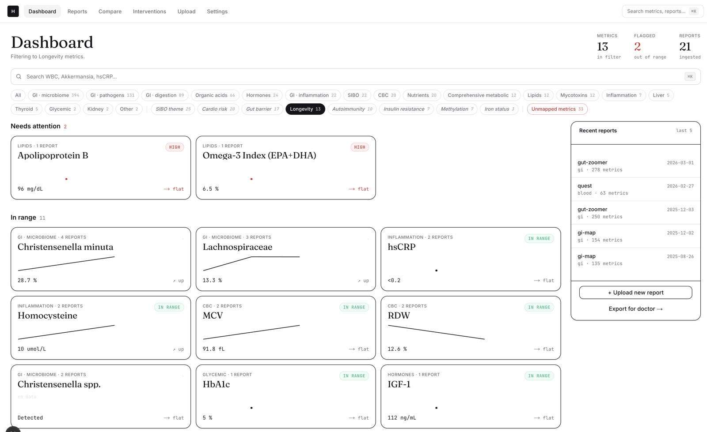
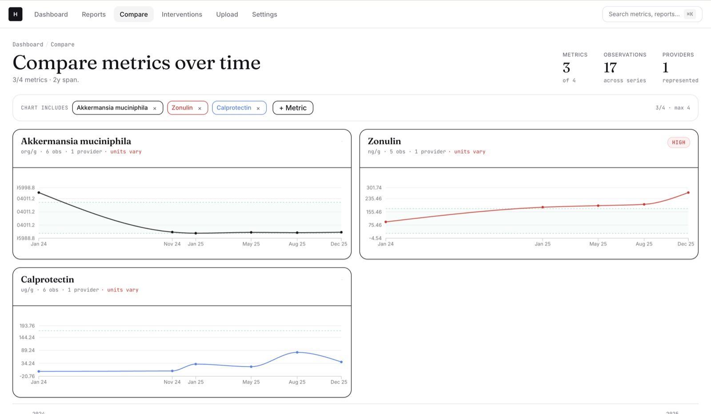
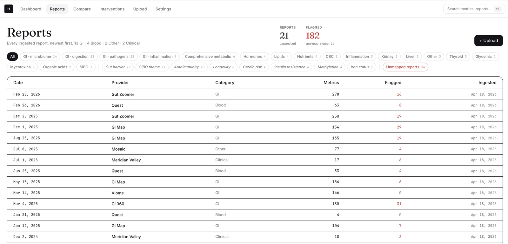
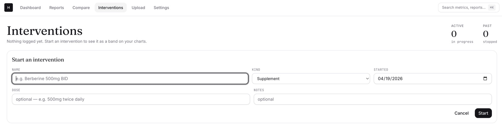
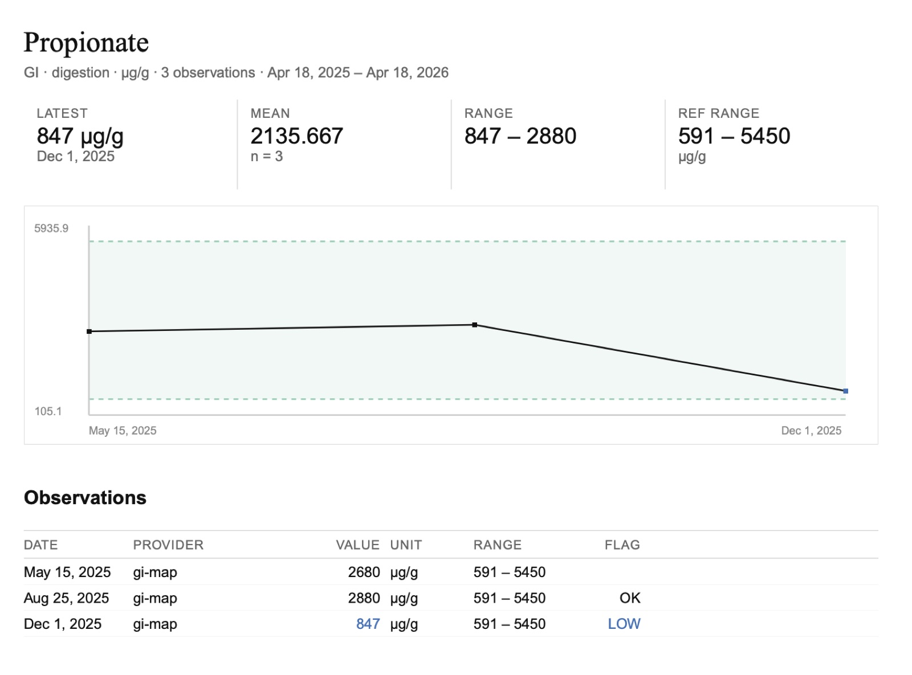

# Health

A local-first personal health dashboard. Ingests varied-format lab, GI, and clinical PDFs via the Claude API, stores normalized metrics in SQLite, and charts them over time across providers.

Single-user, runs entirely on your machine. The only network egress is to the Claude API for PDF extraction.

## Screenshots

<p align="center">
  
  <br><em>Dashboard — grouped by flagged vs in-range, with a recent-reports sidebar.</em>
</p>

<p align="center">
  
  <br><em>Compare up to 4 canonical metrics on a shared time axis.</em>
</p>

<p align="center">
  
  <br><em>Ingested reports list.</em>
</p>

<p align="center">
  
  <br><em>Interventions with overlay bands + markers across every chart.</em>
</p>

<p align="center">
  
  <br><em>Clinician PDF export — per-metric trend pages.</em>
</p>

## Quick start

Requirements: Node 22+ (tested on Node 25), pnpm 10+, and an Anthropic API key.

```bash
git clone git@github.com:lamtha/health.git
cd health
pnpm install
cp .env.example .env
# edit .env and set ANTHROPIC_API_KEY=sk-ant-...
pnpm db:migrate
pnpm dev
```

Open http://localhost:3000. First load shows an empty dashboard; head to `/uploads` to ingest your first PDF.

## Using it

### Upload reports

Go to **`/uploads`** and drop one or many PDFs (blood panel, GI-MAP, GI-360, Gut Zoomer, Viome, MARCoNS, imaging, etc.). Each drop creates a server-tracked upload you can navigate away from and return to via `/uploads/[id]`. PDFs are staged, hashed, and extracted by Claude in the background; duplicates are skipped by hash before any API call. Results land in `uploads/<sha256>.pdf` and the SQLite store.

### Browse

- **`/`** — dashboard grouped by flagged vs in-range, with a recent-reports sidebar.
- **`/metric/[name]`** — time-series chart for a single metric across providers, with reference-range band, per-provider toggles, and a units-mismatch guard.
- **`/reports/[id]`** — per-report detail: panels, the source PDF inline, extraction metadata, raw-JSON link, and an out-of-range sidecar. Each report has **Re-extract** and **Open source PDF** actions.

### Re-extract

Each report's **Re-extract** button re-sends the PDF to Claude and atomically replaces the stored metrics. Previous extractions are appended — never overwritten.

For bulk operations after a prompt upgrade:

```bash
pnpm re-extract                 # live re-run every report
pnpm re-extract -- --replay     # re-derive metrics from stored raw JSON (no Claude calls)
pnpm re-extract -- --only=1,3   # restrict to specific report IDs
```

### Canonical mapping

Every ingested metric row gets linked to a **canonical metric** so "WBC", "White Blood Cell Count", and "Leukocytes" plot as one line. Aliases are seeded at install time (`db/seeds/canonical-metrics.ts`), and any raw name that doesn't resolve surfaces at **`/mappings`**.

Two ways to clear the queue:

- **Manual** — each unmapped row has a "map to existing" / "create new" form. Use this for one-offs or when you want to override the bulk pass.
- **Bulk (AI-assisted)** — the **Propose all unmapped →** button on `/mappings` sends every unmapped name to Claude, writes proposals to `mapping_proposals`, and shows them in a review queue. Approve / reject / edit per row, optionally run **Fixup** (deterministic self-heal for known Claude quirks), then **Apply** to upsert aliases + backfill matching metric rows in one transaction.

After a bulk apply, merge the new canonicals + aliases into the shipped seed file so future installs inherit them:

```bash
pnpm bulk-map --apply-seed --dry-run   # preview: N to append, M aliases to insert
pnpm bulk-map --apply-seed             # idempotent in-place merge of db/seeds/canonical-metrics.ts
pnpm bulk-map --export-seed --out=tmp/seed-diff.ts   # dump the diff to a file for hand-review instead
```

The same CLI still exposes the pre-UI workflow for power use:

```bash
pnpm bulk-map                          # start a new propose run (blocks until done)
pnpm bulk-map --fixup --run=<id>       # deterministic fixup on a run's proposals
pnpm bulk-map --apply --run=<id>       # apply approved proposals
pnpm bulk-map --apply --run=<id> --include-unreviewed   # force-apply with pending proposals treated as rejected
```

If you ran the bulk flow through the packaged Electron app, your DB lives under `~/Library/Application Support/Health/` — point the CLI at it:

```bash
HEALTH_USER_DATA_DIR="$HOME/Library/Application Support/Health" pnpm bulk-map --apply-seed
```

## Configuration

| Variable | Default | Meaning |
|---|---|---|
| `ANTHROPIC_API_KEY` | *(required)* | Extraction credential |
| `ANTHROPIC_EXTRACTION_MODEL` | `claude-sonnet-4-6` | Override the extraction model |

## Data

- SQLite lives at `data/health.db` (gitignored). **This is the crown jewel — back it up.**
- User-uploaded PDFs live at `uploads/<hash>.pdf` (gitignored).
- Raw Claude output is kept in `extractions.raw_json` so metrics can be re-derived without re-spending API calls.

The app treats `~/Documents/health/reports/...` (or any path outside the repo) as **read-only**. It never writes, moves, or mutates source archives.

## Scripts

| Command | What it does |
|---|---|
| `pnpm dev` | Next.js dev server |
| `pnpm build` / `pnpm start` | Production build + serve |
| `pnpm typecheck` | `tsc --noEmit` |
| `pnpm lint` | `next lint` |
| `pnpm db:generate` | Drizzle: generate a migration from schema diff |
| `pnpm db:migrate` | Apply pending migrations |
| `pnpm db:studio` | Drizzle Studio |
| `pnpm re-extract` | Bulk re-extraction CLI (see above) |
| `pnpm bulk-map` | Propose canonical mappings for every unmapped raw name (see above) |

## Stack

Next.js 15 (App Router, TypeScript) · Tailwind v4 + shadcn/ui · Recharts · SQLite via better-sqlite3 · Drizzle ORM · Anthropic SDK with native PDF input.

See [`VISION.md`](./VISION.md), [`ARCH.md`](./ARCH.md), and [`PLAN.md`](./PLAN.md) for scope, architecture, and roadmap. Per-phase changelog is in [`PROGRESS_LOG.md`](./PROGRESS_LOG.md).

## License

MIT — see [`LICENSE`](./LICENSE).
